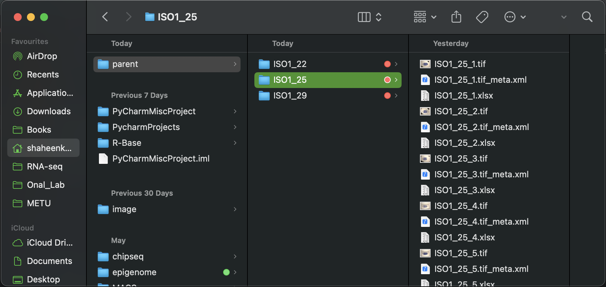

# Eve_analysis

## Folder Structure



You need to have a folder tree like the picture.

## Pipeline Code

```python

import pandas as pd
import numpy as np
import os
import re
import matplotlib.pyplot as plt
from scipy.signal import savgol_filter, find_peaks
from openpyxl.drawing.image import Image as XLImage
from openpyxl import load_workbook
from openpyxl.utils import get_column_letter
import glob

# === Parent folder that contains ISO1_* subfolders ===
parent_folder = "/Users/shaheenkabir/parent"

# === Get all folders matching ISO1_* ===
iso_folders = sorted([
    os.path.join(parent_folder, d)
    for d in os.listdir(parent_folder)
    if os.path.isdir(os.path.join(parent_folder, d)) and d.startswith("ISO1_")
])

for input_folder in iso_folders:
    print(f"\n📂 Starting analysis in: {input_folder}")
    output_folder = os.path.join(input_folder, "results")
    os.makedirs(output_folder, exist_ok=True)

    summary_rows = []

    for filename in os.listdir(input_folder):
        if filename.endswith(".xlsx"):
            input_path = os.path.join(input_folder, filename)
            output_path = os.path.join(output_folder, f"processed_{filename}")
            temp_plot_path = "temp_plot.png"

            print(f"📄 Processing {filename}...")

            try:
                # Load data
                data = pd.read_excel(input_path)
                length = data.iloc[:, 0]
                intensity = data.iloc[:, 1]

                # Normalize and invert
                norm_intensity = intensity / intensity.max()
                inverted_intensity = 1 - norm_intensity
                norm_length = length / length.max()
                percent_length = norm_length * 100

                # Smooth and calculate derivatives
                smoothed = savgol_filter(inverted_intensity, 11, 2)
                diff = np.diff(smoothed, prepend=smoothed[0])
                change_points = np.diff(np.sign(diff), prepend=0)
                change_point_flags = (change_points < 0).astype(int)

                # Detect peaks
                peaks, _ = find_peaks(smoothed, distance=5, prominence=0.01)
                peak_percent_lengths = percent_length.iloc[peaks].values
                peak_values = smoothed[peaks]
                valid_peak_mask = peak_percent_lengths > 25
                peak_percent_lengths = peak_percent_lengths[valid_peak_mask]
                peak_values = peak_values[valid_peak_mask]

                # Add columns to DataFrame
                data['Normalized Intensity'] = norm_intensity
                data['Inverted Intensity'] = inverted_intensity
                data['Normalized Length'] = norm_length
                data['Percent Length'] = percent_length
                data['Smoothed'] = smoothed
                data['Difference'] = diff
                data['Change Point'] = change_point_flags

                # Save processed data
                data.to_excel(output_path, index=False)

                # Save plot
                plt.figure(figsize=(5, 3))
                plt.plot(percent_length, smoothed, label="Smoothed", color='blue')
                plt.scatter(peak_percent_lengths, peak_values, color='red', s=50, label="Peaks > 25%")
                plt.title("Smoothed Inverted Intensity")
                plt.xlabel("Percent Length (%)")
                plt.ylabel("Inverted Intensity")
                plt.legend()
                plt.tight_layout()
                plt.savefig(temp_plot_path, dpi=200)
                plt.close()

                # Insert plot into Excel
                wb = load_workbook(output_path)
                ws = wb.active
                img = XLImage(temp_plot_path)
                img.width = 360
                img.height = 220
                ws.add_image(img, "K2")

                # Add Peaks sheet
                if "Peaks" in wb.sheetnames:
                    del wb["Peaks"]
                peak_ws = wb.create_sheet("Peaks")
                peak_ws.append(["Percent Length", "Inverted Intensity"])
                for x, y in zip(peak_percent_lengths, peak_values):
                    peak_ws.append([x, y])

                # Match peaks to change points
                change_df = data[(data["Change Point"] == 1) & (data["Percent Length"] > 25)]
                closest_matches = []
                for px in peak_percent_lengths:
                    if not change_df.empty:
                        closest = change_df.iloc[(change_df["Percent Length"] - px).abs().argsort()[:1]]
                        closest_val = closest["Percent Length"].values[0]
                        closest_matches.append(closest_val)

                # First 3 stripes
                stripes = closest_matches[:3]
                while len(stripes) < 3:
                    stripes.append(None)

                # Save workbook
                wb.save(output_path)
                os.remove(temp_plot_path)

                # Add Macro sheet
                macro_df = pd.DataFrame({
                    "Percent Length": percent_length,
                    "Inverted Intensity": inverted_intensity
                })

                with pd.ExcelWriter(output_path, engine='openpyxl', mode='a', if_sheet_exists='replace') as writer:
                    macro_df.to_excel(writer, sheet_name='Macro', index=False)

                # Add Macro_600points
                try:
                    indices = np.linspace(0, len(macro_df) - 1, 600, dtype=int)
                    squeezed_macro_df = macro_df.iloc[indices].reset_index(drop=True)
                    with pd.ExcelWriter(output_path, engine='openpyxl', mode='a', if_sheet_exists='replace') as writer:
                        squeezed_macro_df.to_excel(writer, sheet_name='Macro_600points', index=False)
                    print(f"📉 Added 'Macro_600points' to: {output_path}")
                except Exception as e:
                    print(f"❌ Error creating Macro_600points sheet for {filename}: {e}")

                summary_rows.append({
                    "File": filename,
                    "Stripe-1": stripes[0],
                    "Stripe-2": stripes[1],
                    "Stripe-3": stripes[2]
                })

                print(f"✅ Done: {output_path}")

            except Exception as e:
                print(f"❌ Error processing {filename}: {e}")

    # === Final summary file ===

    # Sort summary_rows by numeric suffix in filenames
    def extract_numeric_suffix(filename):
        nums = re.findall(r'(\d+)', filename)
        return tuple(map(int, nums)) if nums else (0,)


    summary_rows_sorted = sorted(summary_rows, key=lambda x: extract_numeric_suffix(x["File"]))
    summary_df = pd.DataFrame(summary_rows_sorted)
    summary_output_path = os.path.join(output_folder, "stripe_summary.xlsx")
    summary_df.to_excel(summary_output_path, index=False)

    # Open the summary workbook
    wb = load_workbook(summary_output_path)
    ws = wb.active

    # Find how many data rows exist (excluding header)
    n = ws.max_row

    # Insert a blank row before AVERAGE and STDEV
    ws.insert_rows(n + 1)

    # Add formulas for AVERAGE and STDEV.P
    ws.cell(row=n + 2, column=1, value="AVERAGE")
    ws.cell(row=n + 3, column=1, value="STDEV.S")

    for col in range(2, 5):  # Stripe-1 (B), Stripe-2 (C), Stripe-3 (D)
        col_letter = get_column_letter(col)
        avg_formula = f"=AVERAGE({col_letter}2:{col_letter}{n})"
        stdev_formula = f"=STDEV.S({col_letter}2:{col_letter}{n})"
        ws.cell(row=n + 2, column=col, value=avg_formula)
        ws.cell(row=n + 3, column=col, value=stdev_formula)

    # Save workbook with formulas
    wb.save(summary_output_path)
    print("📈 Added AVERAGE and STDEV.P rows (with space) to stripe_summary.xlsx")

    print(f"\n📊 Stripe summary written to: {summary_output_path}")

    # === Combine all Macro_600points into one Excel ===
    print("\n🧬 Extracting 600-point Macro sheets...")

    macro_percent_cols = []
    macro_intensity_cols = []
    sample_names = []

    processed_files = sorted(
        [f for f in os.listdir(output_folder) if f.startswith("processed_") and f.endswith(".xlsx")],
        key=lambda x: int(re.findall(r'(\d+)', x)[-1])
    )

    for idx, fname in enumerate(processed_files, start=1):
        fpath = os.path.join(output_folder, fname)
        try:
            df = pd.read_excel(fpath, sheet_name="Macro")
            percent_col = df.iloc[:, 0] / df.iloc[:, 0].max()
            intensity_col = df.iloc[:, 1]

            indices = np.linspace(0, len(df) - 1, 600, dtype=int)
            percent_squeezed = percent_col.iloc[indices].reset_index(drop=True)
            intensity_squeezed = intensity_col.iloc[indices].reset_index(drop=True)

            label = os.path.basename(input_folder) + f"_{idx}"
            sample_names.append(label)
            macro_percent_cols.append(percent_squeezed.rename(label))
            macro_intensity_cols.append(intensity_squeezed.rename(label))
            print(f"✔️ Processed macro sheet from: {fname}")
        except Exception as e:
            print(f"❌ Skipping {fname}: {e}")

    percent_df = pd.concat(macro_percent_cols, axis=1)
    intensity_df = pd.concat(macro_intensity_cols, axis=1)
    percent_df[""] = ""
    intensity_df[""] = ""
    percent_df["Average"] = percent_df.select_dtypes(include=[np.number]).mean(axis=1)
    intensity_df["Average"] = intensity_df.select_dtypes(include=[np.number]).mean(axis=1)

    combined_macro_path = os.path.join(output_folder, "combined_macro_600points.xlsx")
    with pd.ExcelWriter(combined_macro_path) as writer:
        percent_df.to_excel(writer, sheet_name="Percent Length", index=False)
        intensity_df.to_excel(writer, sheet_name="Inverted Intensity", index=False)

    print(f"📊 Final combined macro saved to: {combined_macro_path}")

# === Collect averages from all ISO1_* folders ===

output_combined_file = os.path.join(parent_folder, "all_avg_summary.xlsx")

length_averages = []
intensity_averages = []
labels = []

for subdir in sorted(glob.glob(os.path.join(parent_folder, "ISO1_*"))):
    combined_path = os.path.join(subdir, "results", "combined_macro_600points.xlsx")
    if os.path.exists(combined_path):
        try:
            percent_df = pd.read_excel(combined_path, sheet_name="Percent Length")
            intensity_df = pd.read_excel(combined_path, sheet_name="Inverted Intensity")

            avg_length = percent_df["Average"]
            avg_intensity = intensity_df["Average"]

            name = os.path.basename(subdir)
            labels.append(name)
            length_averages.append(avg_length.rename(name))
            intensity_averages.append(avg_intensity.rename(name))

            print(f"✅ Extracted averages from: {name}")

        except Exception as e:
            print(f"⚠️ Could not extract from {subdir}: {e}")
    else:
        print(f"❌ Missing file in: {subdir}")

# Combine all into two DataFrames
length_avg_df = pd.concat(length_averages, axis=1)
intensity_avg_df = pd.concat(intensity_averages, axis=1)

# Write to new Excel file
with pd.ExcelWriter(output_combined_file) as writer:
    length_avg_df.to_excel(writer, sheet_name="Average Percent Length", index=False)
    intensity_avg_df.to_excel(writer, sheet_name="Average Intensity", index=False)

print(f"\n📈 Final summary of averages saved to: {output_combined_file}")

# === Plot all average curves ===
plt.figure(figsize=(7, 5))
for label, x, y in zip(labels, length_averages, intensity_averages):
    plt.plot(x, y, label=label)

plt.xlabel("Percent Length (%)")
plt.ylabel("Inverted Intensity")
plt.title("Average Intensity Curves")
plt.legend()
plt.tight_layout()

# Save plot
plot_path = os.path.join(parent_folder, "average_plot.png")
plt.savefig(plot_path, dpi=300)
plt.close()

print(f"🖼️ Plot saved to: {plot_path}")
